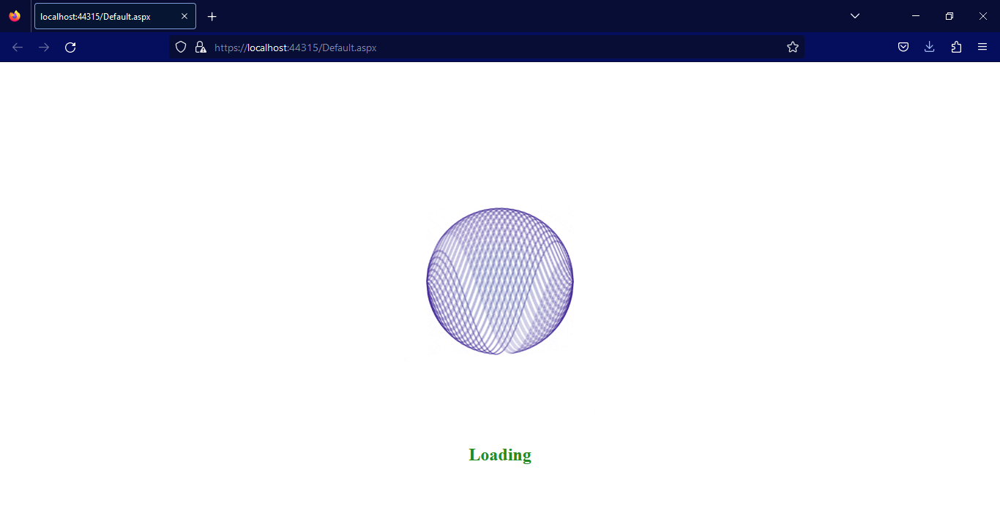
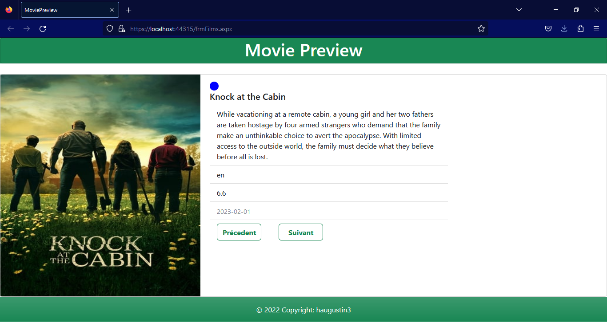

# Movie_Preview_WebAPP
**Movie_Preview_WebAPP** is a web application made with ASP.NET. The main fonction of the application
is to show brand new release movies using the IMDB api.

## User Stories

The following functionality is completed:

- [x] Splash screen is shown on start.
- [x] Poster and content of new release movies.
- [x] When Poster is clicked, it redirects the user to the trailer page.

## Demo

Here's a demo of implemented user stories:

## Open-source ressources used

- [ASP.NET](https://dotnet.microsoft.com/en-us/apps/aspnet)
- [IMDB developper](https://developer.imdb.com/)
- [Bootstrap](https://getbootstrap.com/)
